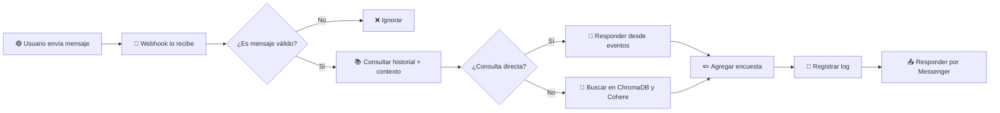

# 🤖 Asistente Virtual Institucional – Secretaría de Ciencia y Tecnología

Este proyecto implementa un chatbot automatizado de atención ciudadana, diseñado para responder consultas sobre eventos, cursos, talleres, charlas, capacitaciones y convocatorias organizadas por la Secretaría de Ciencia y Tecnología, utilizando Facebook Messenger como canal de contacto.

---

## 📌 Características principales

- Conexión a **Facebook Messenger** mediante Webhooks.
- Uso de **LLM (Cohere)** con integración RAG (Retrieval Augmented Generation) para generar respuestas precisas y contextualizadas.
- Base documental consultable en **ChromaDB**.
- Gestión de logs de interacción y auditoría en el backoffice.
- Cacheo temporal de conversaciones para mantener contexto (via `django.core.cache` / alternativa robusta: Redis).
- Soporte inicial para encuestas de satisfacción post-conversación.
- Preparado para múltiples canales (aunque el MVP solo usa Facebook).

---

## 🚀 Arquitectura

- **Backend:** Django 5.x
- **IA:** Cohere `command-r` / `command-a` + recuperación semántica (RAG)
- **Base de datos SQL:** SQLite (modo dev), compatible con PostgreSQL
- **Cache:** Django Cache (se puede usar Redis en producción)
- **Document store, vectorial DB:** Chromadb (persistente), alternativa robusta Quadrant
- **Canal activo:** Facebook Messenger (token desde `.env`)
- **Infra temporal:** Ngrok / Cloudflare Tunnel para exponer Webhook

---

## 🧪 ¿Cómo funciona?

1. El ciudadano envía un mensaje por Messenger.
2. Django recibe la consulta mediante un Webhook registrado en la app de Facebook.
3. El sistema analiza si es una pregunta general (ej. “¿Qué talleres hay?”) o específica (ej. “¿Hay algo sobre Excel?”).
4. Si corresponde, responde directamente desde la base de datos de eventos.
5. Si no, consulta la base documental (ChromaDB) y genera una respuesta vía Cohere.
6. La respuesta se envía automáticamente al usuario.
7. Se registra la interacción en `LogInteraccion`.

## 🔄 Flujo conversacional del chatbot (Diagrama)


---

## 📄 Endpoints relevantes

| Ruta                       | Descripción                                  |
|----------------------------|----------------------------------------------|
| `/webhook/meta/`           | Webhook oficial de recepción de mensajes     |
| `/admin/`                  | Panel de administración (ABM de contenidos)  |
| `/logs/`                   | Listado de interacciones del bot            |
| `/auditorias/`             | Registro de acciones administrativas         |

---

## 🔐 Variables de entorno

En el archivo `.env`, asegurate de definir:
FB_PAGE_ACCESS_TOKEN=tu_token_de_facebook
COHERE_API_KEY=tu_token_de_cohere

---

## 🛠 Instalación rápida

```bash
# Clonar el repo
git clone https://github.com/tuusuario/asistente-virtual.git
cd asistente-virtual

# Crear entorno virtual
python -m venv venv
source venv/bin/activate  # o venv\Scripts\activate en Windows

# Instalar dependencias
pip install -r requirements.txt

# Migraciones y superusuario
python manage.py migrate
python manage.py createsuperuser

# Cargar datos base
python manage.py shell < scripts/poblar_datos.py

# Iniciar servidor
python manage.py runserver
```

## 🔗 Webhook de Facebook Messenger

Exponé tu puerto local con **Ngrok** o **Cloudflare Tunnel**:

```bash
ngrok http 8000
```
Registrá el Webhook en developers.facebook.com con la siguiente URL:
```
https://<tu-url>.ngrok-free.app/webhook/meta/
```

Verificá el token (por ejemplo: 12345) y activá los siguientes campos:

messages

messaging_postbacks

## 🎥 Demostración
Ver video de demostración.
Muestra el flujo completo desde un mensaje hasta la respuesta automática del bot.

## 📜 Política de privacidad
La política de privacidad está disponible en:
https://facundopazbuxeda.github.io/chatbot_scyt/politica-privacidad.html

## 🔐 Permisos solicitados a Meta

| Permiso                       | Justificación técnica                                  |
|----------------------------|----------------------------------------------|
| pages_messaging	| Para responder a mensajes entrantes de la fanpage. |
| pages_read_engagement	| Para leer el contenido del mensaje enviado por el ciudadano. |
| pages_manage_metadata	| Para registrar y verificar el webhook de la app. |
| pages_show_list	| Para asociar correctamente la página con el token del bot. | 

## 📞 Contacto
Para soporte o consultas técnicas sobre el funcionamiento del asistente, puedes escribir a:

📧 facundopazbuxeda@gmail.com